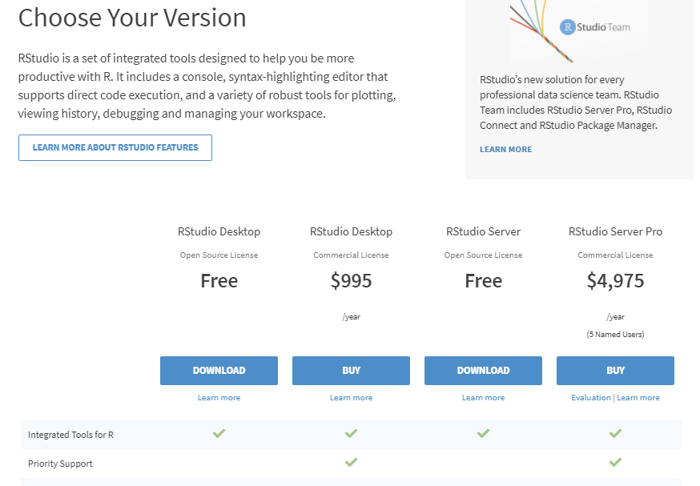

```{r r_software, include=FALSE}
# This is an R setup chunk, containing default options applied to all other chunks
library(knitr)
# This sets the chunk default options
opts_chunk$set(echo=FALSE, cache=FALSE, collapse=TRUE, error=FALSE, prompt=TRUE,fig.align = "center",fig.cap= "",out.width = "120%")
# This sets the chunk display theme
thm <- knit_theme$get("edit-kwrite")
knit_theme$set(thm)
# This sets some display options
options(digits=3)

```


## O Software R 

```{r out.width = "90%"}
knitr::include_graphics("figures/logo_r.jpg")
```

## Histórico
- R foi criado em 1990 na Universidade de Auckland por Ross Ihaka e Robert Gentleman
- Inspirado na linguagem S que foi desenvolvido na Bell Laboratories (1970)
- R – open Source, 1995
- R 1.0.0 em 2000 - R Core Team


## Software Livre 

**R está disponível como Software Livre nos termos da Licença Pública Geral GNU do Free Software Foundation em código fonte**

## R - O que é?

**R é uma linguagem e um ambiente computacional para manipulação de dados, estatística e gráficos**

**É um ambiente dentro do qual as técnicas estatísticas são implementadas**

## Sistema Operacionais
- compila e funciona em plataformas Linux, Windows e MacOS. 

## Packages  
**R pode ser estendido (facilmente) através de pacotes**
- alguns (oito)  pacotes fornecidos com a distribuição R
- e mais 16333 disponíveis no sites (em set./2020)

## Documentation
**R tem seu próprio formato de documentação tipo LaTeX**

## Site

 - *https://www.r-project.org/*
 - CRAN -  Comprehensive R Archive Network (URLs)
 - ex. *https://cran.fiocruz.br/*


## Sistemas Operacionais

```{r }
knitr::include_graphics("figures/r_03.png")
```


## Subdiretorios e versões


```{r out.width = "90%"}

```


## Download e Instalação

```{r, out.width = "90%", fig.cap= ""}
knitr::include_graphics("figures/r_01.png")
```


# RStudio

## RStudio - O que é?

**O ambiente integrado facilita e potencializa a programação em R**

## RStudio - Características

- IDE - Ambiente Integrado de Desenvolvimento
- Contém: console, editor (syntax-highlighting e execução) 
- Gerencia os gráficos (plots)
- History 
- Work space e Debbug


## RStudio - Site

 - *https://www.rstudio.com/*
 - *https://www.rstudio.com/products/rstudio/download/*


## Download

```{r out.width = "80%"}

```

## Escolha do instalador (Sistema Operacional)

```{r out.width = "80%"}

```


## Instalador (Windows)

```{r out.width = "80%"}
knitr::include_graphics("figures/rs_02_1.png")
```


## Principais Funções


```{r out.width = "90%"}
knitr::include_graphics("figures/rs_03_1.png")
```


## Usando o Script

```{r out.width = "90%"}
knitr::include_graphics("figures/rs_04.png")
```


## Criando um Script

```{r out.width = "80%"}
knitr::include_graphics("figures/rstudio_script.png")
```

## Salvando o Script

```{r out.width = "80%"}

```

## O Script Salvo

```{r out.width = "80%"}
knitr::include_graphics("figures/rstudio_script_salvo.png")
```

## Código no Script

```{r out.width = "80%"}

```

## Executando comandos 

```{r out.width = "80%" }

```

## Resultados na Console 

```{r out.width = "80%"}

```


## Atividade

1. Faça a instalação do R
1. Instale o RStudio
1. Explore o RStudio criando um script básico
