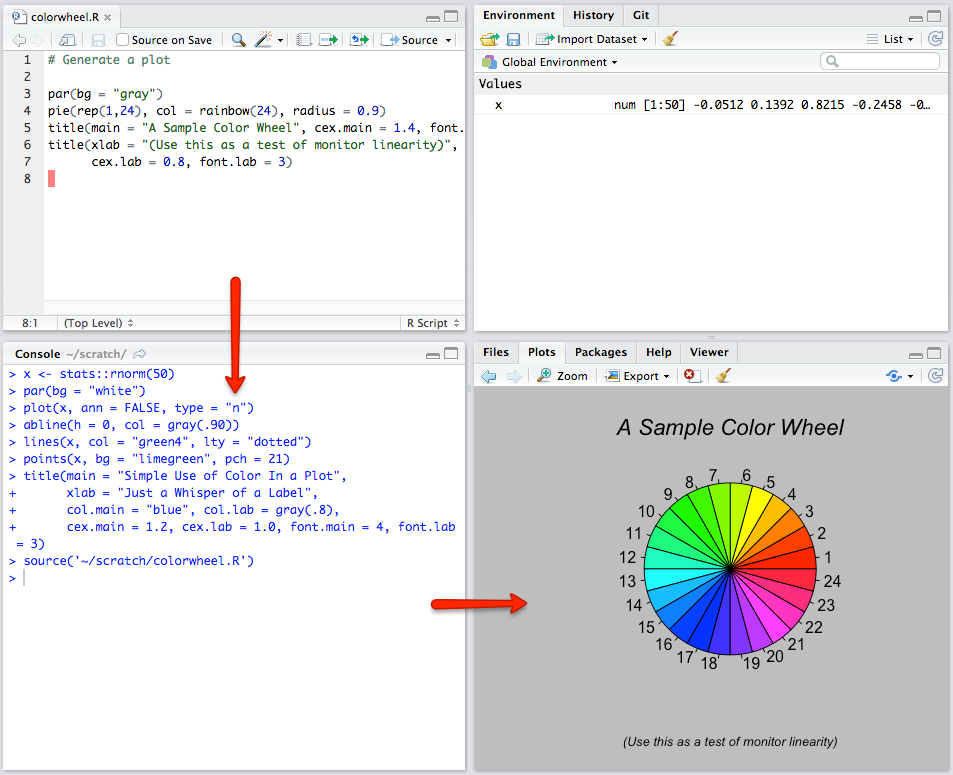
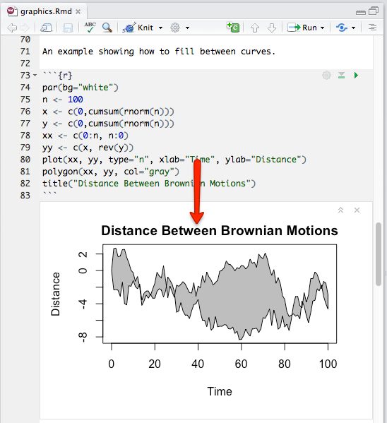

# R Notebook

## Nível 1: Usuário Básico em R 


```{r, out.width = "70%",fig.cap= ""}

```

> - Trabalha direto na console do R
> - Utilização simples do R
> - Não reproduzível


## Nível 2: Usuário Intermediário em R

<div id="right">
```{r, out.width = "80%",fig.cap= ""}

```
</div>

<div id="left">
> - Estrátégia da maioria dos usuários de R
> - Escrever o código em um editor 
> - As saídas são salvas separadamente
> - *Export/copy/paste* são necessários
> - Geralmente não há documentação 
</div>

## Nível 3: Usuário Avançado em R

```{r, out.width = "70%",fig.cap= ""}
knitr::include_graphics("figures/level-3.png")
```

> - Utiliza ferramentas para integrar código e texto
> - Gera documentos, mas ainda precisa das janelas de comandos e de visualização 


## Nível 4: Usuário de R Notebooks
<div id="right">
> - Integra código e texto
> - Gera documentos sem depender da console ou do visualizador
> - Usa o *Notebook*
</div>

<div id="left">
```{r, out.width = "80%",fig.cap= ""}

```
</div>

## R Notebooks Summary

1. Utiliza R Markdown (linguagem de marcação transforma texto em XHTML válido.)
1. Interage com o  R em um **fluxo contínuo**.
1. **Interção rápida**; código e resultado juntos.Visualização imediata 
1. Gera um **arquivo reproduzível** com boa qualidade (output).
1. **Compartilha e Publica** facilmente.
1. **One-click export** para PDF, Word, etc.


## A melhor ferramenta para análise

>- Um documento HTML (self-contained)
>- Fácil compartilhamento
>- Uso de Funções dinâmicas
>- Veja exemplo: [html_dinamico](file:///C:/Users/Cassio/Documents/cassio/Trabalhos/Programas%20em%20R/rmark/html_dinamico.html)

## Criando um RNotebooks - open


```{r, out.width = "60%",fig.cap= ""}

```


## Estrutura básica

- Cabeçalho (*YAML*)
- *chunks*
- texto

```{r, out.width = "100%",fig.cap= ""}

```


## Cabeçalho - *YAML*

```{r, out.width = "60%",fig.cap= ""}

```


## Cabeçalho - Complementos

- author: "nome"
- date: "11/09/2017"

## O *chunk* 


```{r, out.width = "50%",fig.cap= ""}

```


```{r}
summary(cars)
```


## Incluindo código R no texto

Para executar um código r no texto: 

```{r, out.width = "120%",fig.cap= ""}

```


 **O valor máximo em "c(5, 7, 15)" é `r max(c(5, 7, 15))`**


```{r child = 'rr_rnotebook_atividade.Rmd'}


```


## Referências

- RStudio Preview: site: https://www.rstudio.com/products/rstudio/download/preview/

- R Notebooks: site: http://rmarkdown.rstudio.com/r_notebooks.html

